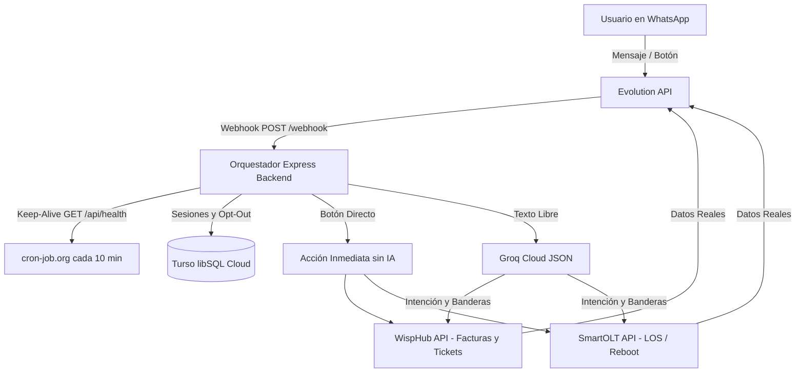

# Chatbot WhatsApp ISP 🚀 (JedNet Telecom)

Backend inteligente para automatización de soporte técnico y cobranza para ISP (Proveedores de Internet) desplegado en **Render**, con base de datos en la nube en **Turso (libSQL)**, traducción de lenguaje natural a JSON con **Groq**, integración con **WispHub**, **SmartOLT** y **Evolution API**.

---

## 🛠️ Arquitectura del Sistema



---

## 🌟 Características Principales

1. **Persistencia Cloud en Turso (libSQL):**
   - No pierde las sesiones cuando Render apaga o reinicia el contenedor (disco efímero resuelto).
   - Guarda número de teléfono, cliente, servicio, ONU ID y banderas de opt-out.

2. **Traductor de Lenguaje Natural a JSON con Groq:**
   - La IA nunca le responde al usuario final (cero alucinaciones).
   - Extrae intenciones: `SALUDO`, `CONSULTAR_SALDO`, `REPORTAR_PAGO`, `FALLA_INTERNET`, `REINICIAR_MODEM`, `DATOS_WIFI`, `HABLAR_HUMANO`, `CANCELAR_SUSCRIPCION`.
   - Extrae banderas críticas: `foco_rojo`, `equipo_apagado`, `reporta_lentitud`, `ya_reinicio`.

3. **Módulos ISP (WispHub + SmartOLT):**
   - **WispHub:** Búsqueda por 10 dígitos o nombre, consulta de facturas pendientes con enlace de pago directo, creación automática de tickets de soporte técnico.
   - **SmartOLT:** Diagnóstico físico de ONU (`LOS` por corte de fibra, `Power fail` por apagón, `Online` con lectura de potencia óptica en dBm) y comando de reinicio remoto.

4. **Reglas Anti-Baneo Integradas:**
   - Variación de plantillas (Spintax: `{Hola|Buen día}`).
   - Simulación de presencia (`presence: "composing"`).
   - Retardos humanos dinámicos (1.5s a 2.5s) y Jitter para difusiones (8s a 15s).
   - Mecanismo de Opt-Out automático cuando el usuario responde `CANCELAR` o `BAJA`.

5. **Anti-Sleep en Render (cron-job.org):**
   - Endpoint `GET /api/health` con ping a Turso DB para mantener despierto el plan gratuito de Render.

---

## 📋 Variables de Entorno (`.env`)

Copia `.env.example` a `.env` y configura tus valores:

```env
PORT=3000
NODE_ENV=production

# Turso DB
TURSO_DATABASE_URL=libsql://chatbot-jednet.aws-us-east-1.turso.io
TURSO_AUTH_TOKEN=tu-token-jwt-de-turso

# Groq Cloud
GROQ_API_KEY=gsk_tu_clave_de_groq
GROQ_MODEL=openai/gpt-oss-20b

# Evolution API
EVOLUTION_URL=https://tu-evolution-api.com
EVOLUTION_API_KEY=tu_clave_evolution
INSTANCE_NAME=isp-soporte

# WispHub API
WISPHUB_API_URL=https://api.wisphub.net/api
WISPHUB_API_KEY=tu_token_wisphub

# SmartOLT API
SMARTOLT_API_URL=https://tu-dominio.smartolt.com/api
SMARTOLT_API_KEY=tu_token_smartolt

# Negocio
ISP_NAME=JedNet Telecom
SOPORTE_HUMANO_PHONE=521XXXXXXXXXX
```

---

## 🚀 Despliegue en Render

1. En tu servicio en **Render** (`https://dashboard.render.com/web/srv-daea6hht0dsc739e3ccg`):
   - **Build Command:** `npm install && npm run build`
   - **Start Command:** `npm start`
   - **Environment Variables:** Añade las variables de tu archivo `.env`.

2. Configurar **cron-job.org**:
   - URL: `https://chatbot-17n8.onrender.com/api/health`
   - Intervalo: Cada **10 minutos**
   - Método: `GET`

---

## 🐳 Despliegue de Evolution API (Docker)

Para ejecutar Evolution API en un VPS o servidor local:

```bash
docker compose up -d
```

Crea la instancia en Evolution API:

```bash
curl -X POST http://localhost:8080/instance/create \
  -H "apikey: MI_SUPER_CLAVE_SECRETA_2026" \
  -H "Content-Type: application/json" \
  -d '{
    "instanceName": "isp-soporte",
    "qrcode": true,
    "integration": "WHATSAPP-BAILEYS"
  }'
```

Escanea el código QR en: `http://localhost:8080/instance/connect/isp-soporte`.

---

## 🧪 Pruebas Locales

```bash
# Probar conexión con Turso DB
npm run test:turso

# Probar clasificador de lenguaje natural con Groq
npm run test:groq

# Iniciar en modo desarrollo
npm run dev
```
